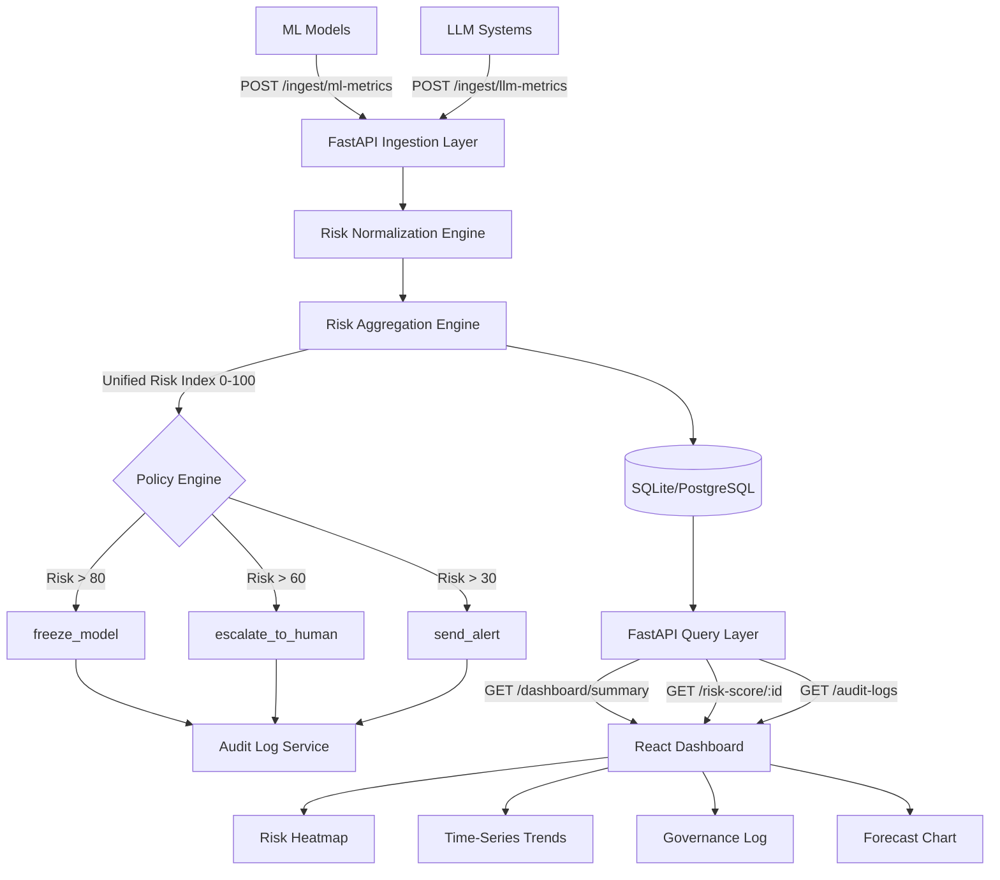

# AegisAI — Unified AI Risk Governance Framework for Banking
## Complete Technical Reference v1.0

---

## 1. SYSTEM ARCHITECTURE

```
┌─────────────────────────────────────────────────────────────────────────────┐
│                        AegisAI Architecture                                 │
│                                                                              │
│  TELEMETRY SOURCES          INGESTION LAYER          PROCESSING ENGINES     │
│  ─────────────────          ───────────────          ──────────────────     │
│                                                                              │
│  ┌──────────────┐           ┌─────────────┐                                 │
│  │  ML Models   │──REST────▶│  FastAPI    │                                 │
│  │  (drift,bias)│           │  /ingest/ml │──▶ Risk Normalization Engine    │
│  └──────────────┘           └─────────────┘         │                      │
│                                     │                ▼                      │
│  ┌──────────────┐           ┌─────────────┐   ┌─────────────┐              │
│  │  LLM Systems │──REST────▶│  FastAPI    │──▶│ Aggregation │              │
│  │(halluc,injct)│           │  /ingest/   │   │   Engine    │              │
│  └──────────────┘           │    llm      │   │ UARI: 0-100 │              │
│          │                  └─────────────┘   └──────┬──────┘              │
│          │                        │                  │                      │
│  [Optional Kafka]◀─────────────────────────────────┐ │                     │
│   ml-telemetry topic                               │ │                      │
│   llm-telemetry topic                              │ ▼                      │
│                                            ┌──────────────┐                │
│                                            │   Policy &   │                │
│  STORAGE LAYER                             │  Governance  │                │
│  ─────────────                             │    Engine    │                │
│                                            └──────┬───────┘                │
│  ┌──────────────┐   ┌──────────────┐             │                         │
│  │  PostgreSQL  │   │   Redis      │      ┌──────▼────────┐                │
│  │  - models    │   │  (caching    │      │  Governance   │                │
│  │  - risk_evts │   │   real-time  │      │  Actions:     │                │
│  │  - unif_scrs │   │   pub/sub)   │      │ freeze_model  │                │
│  │  - gov_actn  │   └──────────────┘      │ escalate      │                │
│  │  - audit_log │                         │ send_alert    │                │
│  └──────────────┘                         └──────┬────────┘                │
│                                                  │                          │
│  PRESENTATION LAYER          SERVICES            │                          │
│  ──────────────────          ────────            ▼                          │
│                                          ┌──────────────┐                  │
│  ┌──────────────────┐           ┌────────┤  Audit Log   │                  │
│  │ React Dashboard  │◀──API────▶│FastAPI │  (immutable) │                  │
│  │ - Risk Heatmap   │           │  GET   │  SHA-256     │                  │
│  │ - Time Series    │           │  /risk │  checksums   │                  │
│  │ - Gauge + Radar  │           │  /dash │              │                  │
│  │ - Gov Log        │           │  /aud  └──────────────┘                  │
│  │ - Forecasting    │           └────────────────────────                  │
│  └──────────────────┘                                                       │
└─────────────────────────────────────────────────────────────────────────────┘
```

### Mermaid Diagram (paste at mermaid.live)


---

## 2. RISK SCORING FORMULA

### Unified AI Risk Index (UARI) Formula

```
UARI = min(100, f( 100 × Σ(wᵢ × sᵢ) ))

Where:
  sᵢ ∈ [0, 1]   — normalized component scores
  wᵢ             — configurable weights (Σwᵢ = 1.0)
  f(x)           — non-linear amplification for x > 60

f(x) = x                              if x ≤ 60
f(x) = 60 + (x-60) × (1 + (x-60)/100) if x > 60
```

### ML Model Weights
| Component             | Weight | Source                     |
|-----------------------|--------|----------------------------|
| drift_score           | 0.30   | PSI/KS statistic           |
| bias_score            | 0.30   | Demographic parity gap     |
| prediction_instability| 0.20   | Std dev of outputs         |
| data_quality_score    | 0.20   | Missing feature rate       |

### LLM Model Weights
| Component             | Weight | Source                         |
|-----------------------|--------|--------------------------------|
| hallucination_score   | 0.30   | Factual error rate             |
| toxicity_score        | 0.20   | Harmful content rate           |
| prompt_injection_risk | 0.25   | Injection attempts / requests  |
| data_leakage_risk     | 0.25   | PII/financial data flags       |

### Risk Thresholds
```
0  ─────────── 30  ─────────── 60  ─────── 80  ──── 100
│    LOW        │   MODERATE   │   HIGH   │ CRITICAL │
│  #00E5A0      │   #F5C842    │ #FF8C42  │ #FF3B5C  │
```

---

## 3. NORMALIZATION FUNCTIONS

### ML Drift (PSI-based Sigmoid)
```python
drift_score = 1 / (1 + exp(-10 × (psi - 0.15)))
# PSI = 0.0  → score = 0.18 (low)
# PSI = 0.15 → score = 0.50 (threshold)
# PSI = 0.30 → score = 0.82 (high)
```

### LLM Hallucination
```python
hallucination_score = min(1.0, hallucination_rate × 1.8)
# 0% error rate  → 0.00
# 25% error rate → 0.45
# 56% error rate → 1.00 (capped)
```

### Prompt Injection Risk
```python
injection_rate = prompt_injection_attempts / total_requests
prompt_injection_risk = 1 / (1 + exp(-50 × (rate - 0.02)))
# 0%  injection → 0.27
# 2%  injection → 0.50 (threshold)
# 5%  injection → 0.82 (high)
```

---

## 4. API ENDPOINTS

### POST /ingest/ml-metrics
```json
{
  "model_id": "credit-scoring-v3",
  "drift_magnitude": 0.18,
  "bias_disparity": 0.12,
  "pred_std_dev": 0.09,
  "missing_rate": 0.03,
  "evaluation_window_hours": 24,
  "sample_size": 5000
}
```
**Response:**
```json
{
  "status": "accepted",
  "event_id": "f3a2b1c0-...",
  "model_id": "credit-scoring-v3",
  "unified_risk_index": 42.8,
  "risk_level": "moderate",
  "timestamp": "2026-02-17T14:32:00Z"
}
```

### POST /ingest/llm-metrics
```json
{
  "model_id": "loan-advisor-llm-v2",
  "hallucination_rate": 0.08,
  "toxicity_rate": 0.02,
  "prompt_injection_attempts": 14,
  "sensitive_data_flags": 3,
  "total_requests": 2400,
  "evaluation_window_hours": 24
}
```

### GET /risk-score/{model_id}
```json
{
  "model_id": "kyc-screening-ml",
  "risk_index": 83.7,
  "risk_level": "critical",
  "component_scores": {
    "drift_score": 0.38,
    "bias_score": 0.91,
    "prediction_instability": 0.44,
    "data_quality_score": 0.62
  },
  "timestamp": "2026-02-17T14:30:00Z",
  "forecast_next": 86.2
}
```

### GET /dashboard/summary
```json
{
  "total_models": 6,
  "average_risk_index": 49.8,
  "risk_distribution": {
    "low": 2, "moderate": 2, "high": 1, "critical": 1
  },
  "models": [...],
  "governance_actions": [...],
  "compliance_score": 50.2
}
```

---

## 5. DATABASE SCHEMA

```sql
-- Models Registry
CREATE TABLE models (
    id              TEXT PRIMARY KEY,
    name            TEXT NOT NULL,
    model_type      TEXT NOT NULL,  -- 'ml' | 'llm'
    business_unit   TEXT,
    owner           TEXT,
    status          TEXT DEFAULT 'active',
    registered_at   TEXT NOT NULL
);

-- Append-only telemetry events
CREATE TABLE risk_events (
    id                TEXT PRIMARY KEY,
    model_id          TEXT NOT NULL,
    model_type        TEXT NOT NULL,
    event_type        TEXT NOT NULL,
    raw_payload       TEXT NOT NULL,  -- JSON
    normalized_scores TEXT NOT NULL,  -- JSON
    timestamp         TEXT NOT NULL
);

-- Current risk state per model (upserted)
CREATE TABLE unified_scores (
    model_id          TEXT PRIMARY KEY,
    risk_index        REAL NOT NULL,
    risk_level        TEXT NOT NULL,
    component_scores  TEXT NOT NULL,  -- JSON
    timestamp         TEXT NOT NULL
);

-- Time-series for trend analysis
CREATE TABLE score_history (
    id          INTEGER PRIMARY KEY AUTOINCREMENT,
    model_id    TEXT NOT NULL,
    risk_index  REAL NOT NULL,
    risk_level  TEXT NOT NULL,
    timestamp   TEXT NOT NULL
);

-- Automated governance actions
CREATE TABLE governance_actions (
    id                  TEXT PRIMARY KEY,
    model_id            TEXT NOT NULL,
    action_type         TEXT NOT NULL,  -- freeze_model | escalate | send_alert
    reason              TEXT,
    triggered_by_risk   REAL,
    status              TEXT DEFAULT 'executed',
    timestamp           TEXT NOT NULL
);

-- Immutable tamper-evident audit log
CREATE TABLE audit_log (
    id          INTEGER PRIMARY KEY AUTOINCREMENT,
    event_id    TEXT NOT NULL,
    model_id    TEXT,
    action      TEXT NOT NULL,
    actor       TEXT DEFAULT 'system',
    details     TEXT,        -- JSON
    checksum    TEXT,        -- SHA-256 tamper detection
    timestamp   TEXT NOT NULL
);
```

---

## 6. POLICY ENGINE — JSON RULESET

```json
{
  "component_policies": {
    "hallucination_score": {
      "thresholds": [
        {
          "condition": ">=",
          "value": 0.7,
          "action": "freeze_model",
          "severity": "critical",
          "reason": "Hallucination rate critically high. Model frozen."
        },
        {
          "condition": ">=",
          "value": 0.4,
          "action": "add_disclaimer_layer",
          "severity": "high"
        }
      ]
    },
    "bias_score": {
      "thresholds": [
        {
          "condition": ">=",
          "value": 0.6,
          "action": "freeze_model",
          "severity": "critical",
          "reason": "Bias exceeds ECOA tolerance. Freeze pending fairness audit."
        }
      ]
    },
    "data_leakage_risk": {
      "thresholds": [
        {
          "condition": ">=",
          "value": 0.3,
          "action": "freeze_model",
          "severity": "critical",
          "reason": "PII/financial data leakage detected. Immediate freeze."
        }
      ]
    }
  },
  "global_risk": {
    "unified_risk_index": {
      "thresholds": [
        {"condition": ">=", "value": 81, "action": "freeze_model"},
        {"condition": ">=", "value": 61, "action": "escalate_to_human"},
        {"condition": ">=", "value": 31, "action": "send_alert"}
      ]
    }
  },
  "regulatory_mapping": {
    "SR_11_7": {"triggers": ["drift_score", "bias_score"]},
    "ECOA":    {"triggers": ["bias_score"]},
    "EU_AI_ACT": {"triggers": ["hallucination_score", "data_leakage_risk"]}
  }
}
```

---

## 7. GOVERNANCE TRIGGER LOGIC

```python
# Pseudo-code flow for governance triggers

def evaluate_and_act(model_id, risk_index, components):

    # CRITICAL: Risk > 80 → Freeze model immediately
    if risk_index > 80:
        freeze_model(model_id)
        notify(["cro", "cto", "compliance"], severity="critical", sla_hours=4)
        log_audit(model_id, "freeze_model", risk_index)

    # HIGH: Risk 61–80 → Escalate to human review
    elif risk_index > 60:
        create_review_ticket(model_id, assignee="model_risk_team")
        notify(["model_risk_team", "compliance"], sla_hours=24)
        log_audit(model_id, "escalate_to_human", risk_index)

    # MODERATE: Risk 31–60 → Alert and increase monitoring
    elif risk_index > 30:
        send_alert(model_id, channels=["slack", "email"])
        increase_monitoring_frequency(model_id)
        log_audit(model_id, "send_alert", risk_index)

    # Component-level triggers (independent of global)
    if components.get("bias_score", 0) >= 0.6:
        freeze_model(model_id, reason="ECOA violation")
        trigger_fairness_audit(model_id)

    if components.get("data_leakage_risk", 0) >= 0.3:
        freeze_model(model_id, reason="PII leakage")
        notify_dpo(model_id)  # Data Protection Officer
```

---

## 8. FORECASTING ALGORITHM

```python
def forecast(history: list[float], window: int = 5) -> dict:
    """
    Moving Average Forecast with Anomaly Detection
    """
    # 1. Moving average series
    ma_series = [
        mean(history[max(0, i-window):i+1])
        for i in range(len(history))
    ]

    # 2. Trend detection (linear slope of last 5 points)
    recent = history[-5:]
    slope = (recent[-1] - recent[0]) / 4  # per step
    trend = "increasing" if slope > 1 else "decreasing" if slope < -1 else "stable"

    # 3. Anomaly detection — Z-score threshold = 2.0
    mu, sigma = mean(history), stdev(history)
    anomalies = [
        {"step": i, "score": s, "z": abs((s - mu) / sigma)}
        for i, s in enumerate(history)
        if abs((s - mu) / sigma) > 2.0
    ]

    # 4. Forecast next 3 steps
    last = list(history)
    forecast = []
    for _ in range(3):
        next_val = mean(last[-window:]) + slope * 0.5
        forecast.append(round(min(100, max(0, next_val)), 1))
        last.append(next_val)

    return {
        "trend": trend,
        "moving_average": ma_series,
        "anomalies": anomalies,
        "forecast_next_3": forecast,
        "spike_risk": "high" if max(forecast) >= 80 else "moderate" if max(forecast) >= 60 else "low"
    }
```

---

## 9. AUDIT LOG STRUCTURE

```json
{
  "id": 42,
  "event_id": "f3a2b1c0-8d4e-4f5a-b6c7-d8e9f0a1b2c3",
  "model_id": "kyc-screening-ml",
  "action": "governance_freeze_model",
  "actor": "system",
  "details": {
    "action": "freeze_model",
    "severity": "critical",
    "triggered_by": "bias_score",
    "triggered_value": 0.91,
    "reason": "Bias exceeds ECOA threshold",
    "regulatory_refs": ["ECOA", "SR_11_7"]
  },
  "checksum": "a3f8c2b1d4e5f6a7b8c9d0e1f2a3b4c5...",
  "timestamp": "2026-02-15T14:32:11.847Z"
}
```

**Checksum Verification:**
```python
# Tamper detection
checksum_input = f"{event_id}|{model_id}|{action}|{actor}|{details}|{timestamp}"
expected = hashlib.sha256(checksum_input.encode()).hexdigest()
is_valid = expected == stored_checksum
```

---

## 10. HOW TO RUN LOCALLY

### Quick Start (SQLite — no Docker needed)

```bash
# 1. Clone and navigate
git clone https://github.com/your-org/aegisai
cd aegisai/backend

# 2. Create virtual environment
python -m venv venv
source venv/bin/activate  # Windows: venv\Scripts\activate

# 3. Install dependencies
pip install fastapi uvicorn pydantic python-multipart

# 4. Start the API server
uvicorn main:app --reload --port 8000

# 5. Open API docs
open http://localhost:8000/docs

# 6. Test the endpoints
curl http://localhost:8000/health
curl http://localhost:8000/dashboard/summary
curl http://localhost:8000/risk-score/kyc-screening-ml

# 7. Ingest test metrics
curl -X POST http://localhost:8000/ingest/ml-metrics \
  -H "Content-Type: application/json" \
  -d '{
    "model_id": "test-model",
    "drift_magnitude": 0.35,
    "bias_disparity": 0.7,
    "pred_std_dev": 0.2,
    "missing_rate": 0.15
  }'
```

### Full Stack with Docker

```bash
# Navigate to docker directory
cd aegisai/docker

# Start core services (API + Postgres + Redis)
docker-compose up --build

# Start with Kafka telemetry pipeline
docker-compose --profile kafka up --build

# Verify services
curl http://localhost:8000/health
curl http://localhost:8000/dashboard/summary
```

### Frontend Dashboard (React)

```bash
# 1. Create React app
npx create-react-app aegisai-dashboard
cd aegisai-dashboard

# 2. Install dependencies
npm install recharts

# 3. Replace src/App.jsx with AegisAI_Dashboard.jsx

# 4. Start development server
npm start
# Dashboard at: http://localhost:3000
```

---

## 11. CLOUD DEPLOYMENT (AWS)

```
┌─────────────────────────────────────────────────────────┐
│                    AWS Architecture                       │
│                                                          │
│  Route 53 → CloudFront → ALB → ECS Fargate (FastAPI)   │
│                                    │                     │
│                          ┌─────────┴─────────┐          │
│                          │                   │           │
│                     RDS Aurora          ElastiCache      │
│                     PostgreSQL            Redis          │
│                          │                              │
│                     MSK (Kafka)                         │
│                          │                              │
│             CloudWatch Logs + Metrics                   │
│             → Alerts → SNS → PagerDuty                 │
└─────────────────────────────────────────────────────────┘
```

**Key AWS Services:**
- **ECS Fargate** — serverless containers for FastAPI
- **RDS Aurora PostgreSQL** — managed production database
- **ElastiCache Redis** — managed caching + pub/sub
- **MSK (Managed Kafka)** — enterprise telemetry ingestion
- **CloudWatch** — operational metrics and log aggregation
- **Secrets Manager** — database credentials and API keys
- **VPC** — network isolation for banking compliance

---

## 12. REGULATORY COMPLIANCE MAPPING

| Regulation | Trigger Component       | Required Action              |
|------------|------------------------|------------------------------|
| SR 11-7    | drift_score, bias_score | Document, review, revalidate |
| ECOA       | bias_score ≥ 0.6        | Freeze + fairness audit      |
| EU AI Act  | hallucination, leakage  | Conformity assessment        |
| DORA       | system availability     | Incident reporting           |
| GDPR/CCPA  | data_leakage_risk ≥ 0.3 | DPO notification, freeze     |

---

*AegisAI v1.0 — Prototype Reference Architecture*
*For production deployment, consult your Model Risk Management framework.*
